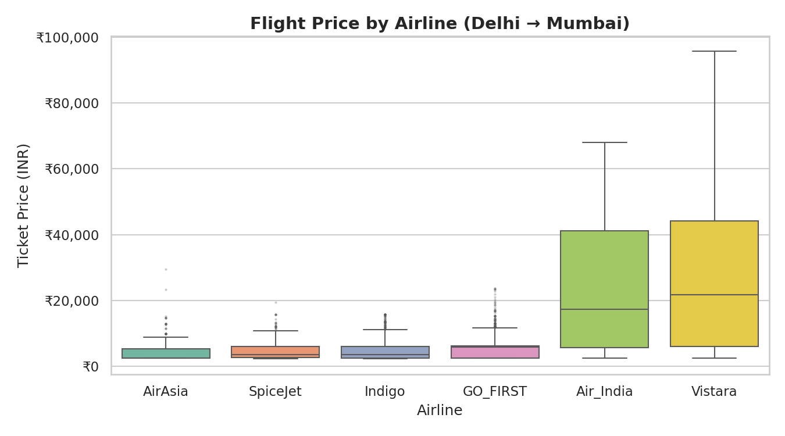
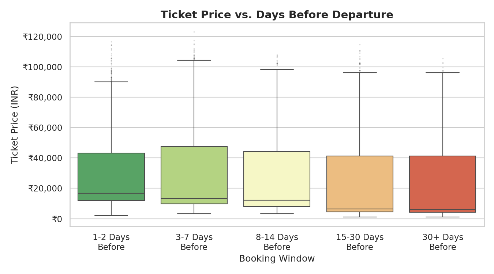
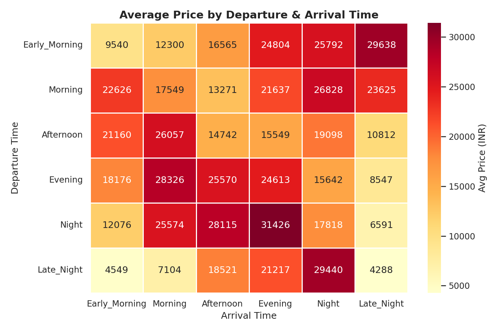
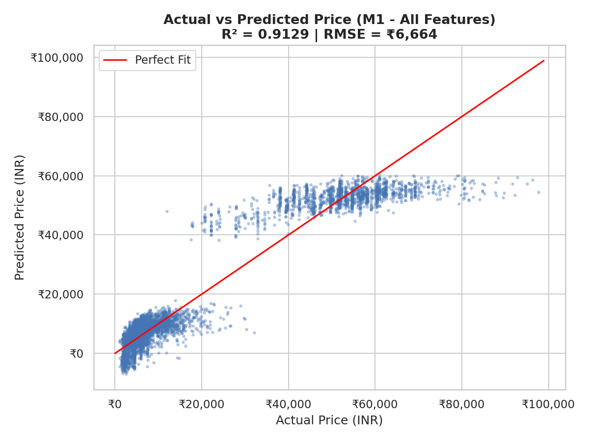

# ✈️ Flight Price Prediction using Linear Regression

A machine learning project that predicts airline ticket prices using Linear Regression, implemented in **R**.

---

## 📁 Repository Structure

```
flight-delay-analysis/
├── analysis.R          # Full R analysis script
├── flight-data.csv     # Dataset (300,153 records)
├── report.pdf          # Complete project report
├── plot1.png           # Price by airline (Delhi → Mumbai)
├── plot2.png           # Price vs. booking window
├── plot3.png           # Departure/arrival time heatmap
├── plot4.png           # Price distribution before/after outlier removal
├── plot5.png           # Actual vs. predicted prices (M1)
├── plot6.png           # Feature importance (top 10 coefficients)
└── README.md           # This file
```

---

## 📊 Dataset

The **Flight Price Prediction** dataset contains **300,153 records** with the following features:

| Feature | Type | Description |
|---|---|---|
| airline | Categorical | 6 airlines (SpiceJet, Vistara, AirAsia, Indigo, GO_FIRST, Air_India) |
| source_city | Categorical | Departure city |
| departure_time | Categorical | Time of day bin (Early Morning, Morning, ...) |
| stops | Categorical | zero, one, two_or_more |
| arrival_time | Categorical | Arrival time bin |
| destination_city | Categorical | Destination city |
| class | Categorical | Economy or Business |
| duration | Numeric | Flight duration (hours) |
| days_left | Numeric | Days between booking and departure |
| **price** | **Target** | **Ticket price in INR** |

---

## 🔍 Key Questions Analysed

1. **Does price vary with airlines** for the same source → destination?
2. **How does price change** when tickets are bought 1–2 days before departure?
3. **Does departure/arrival time** affect ticket prices?
4. **Price distribution** — outlier detection and removal using IQR method.
5. **M1 vs M2** — all features vs. top 5 features, comparing R² and Adjusted R².
6. **Linear Regression** — model built using both base R (`lm`) and Statsmodels-equivalent OLS.

---

## ⚙️ Methodology

```
Raw Data (300,153 rows)
        │
        ▼
  Data Cleaning
  - Remove duplicates
  - Drop high-cardinality 'flight' column
  - No missing values found
        │
        ▼
  Outlier Removal (IQR Method)
  → 300,030 clean records remain
        │
        ▼
  Feature Engineering
  - One-hot encode all categorical variables (drop-first)
        │
        ▼
  Train/Test Split: 80% / 20%  (seed = 42)
        │
        ├──► M1: Linear Regression (All Features)
        │         R² = 0.9129 | RMSE = ₹6,664
        │
        └──► M2: Linear Regression (Top 5 Features)
                  R² = 0.9021 | RMSE = ₹7,067
```

---

## 📈 Results

| Metric | M1 – All Features | M2 – Top 5 Features |
|---|---|---|
| R² | **0.9129** | 0.9021 |
| RMSE | ₹6,664 | ₹7,067 |
| Features | All encoded | 5 selected |

### Top 5 Features (by coefficient magnitude)
1. `class_Economy`
2. `stops_zero`
3. `airline_Vistara`
4. `airline_SpiceJet`
5. `airline_Indigo`

---

## 🖼️ Visualisations

### Price by Airline (Delhi → Mumbai)


### Price vs. Booking Window


### Departure & Arrival Time Heatmap


### Actual vs. Predicted (M1)


---

## 🚀 How to Run

### Prerequisites
```r
install.packages(c("ggplot2", "dplyr", "tidyr", "caret",
                   "corrplot", "scales", "gridExtra"))
```

### Run the Analysis
```r
# Set working directory to the project folder
setwd("path/to/flight-delay-analysis")

# Place flight-data.csv in the same folder, then:
source("analysis.R")
```

All plots will be saved as `.png` files in the working directory.

---

## 🔮 Future Scope

- Try ensemble methods: **Random Forest**, **Gradient Boosting**, **XGBoost**
- Incorporate real-time flight pricing data
- Add seasonal demand features
- Deploy as a **Shiny web application** for live price estimation

---

## 📚 References

- R Core Team (2024). *R: A Language and Environment for Statistical Computing*
- Wickham H. et al. (2019). *Welcome to the tidyverse*. JOSS.
- Kuhn M. (2008). *Building predictive models in R using the caret package*. JSS.
- Kaggle: [Flight Price Prediction Dataset](https://www.kaggle.com/)

---

## 👩‍💻 Author

**Hiba Muhammed** | Roll No: 25 | S6IE  
Department of Information Engineering
